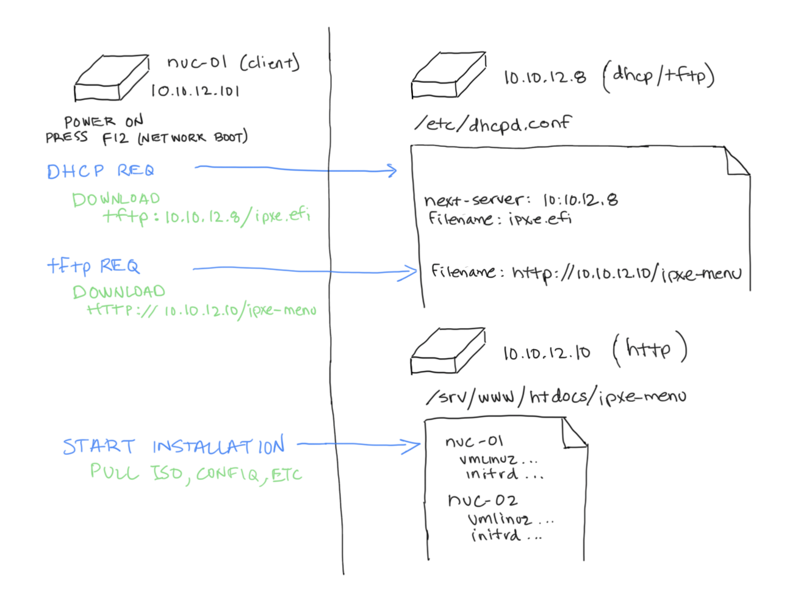

# PXE Overview

## Status
This doc is a work in progress.

## 

This is not a guide or how-to for PXE (there are TONS available already).  I am reviewing this here to explain how I am setting it up for this enclave environmnet to allow network installation of the Harvester Nodes.

There are 3 nodes in this simple explanation:

* client (the node which Harvester will be installed on - and technically there would be 3 of these)
* http server (10.10.12.10 - the server which provides content (ISO/config files) via HTTP) 
* tftp/dhcp server (10.10.12.8 - the server which provides PXE services consisting of the DHCP, then TFTP)

NOTE:  In this image (above) I provide a path to the ipxe-menu which is not entirely congruent with the actual location in the config files.  This was primarily just to save space in the visualization.  
 
/srv/www/htdocs/ipxe.efi => /srv/www/htdocs/harvester/harvester-edge/ipxe.efi
